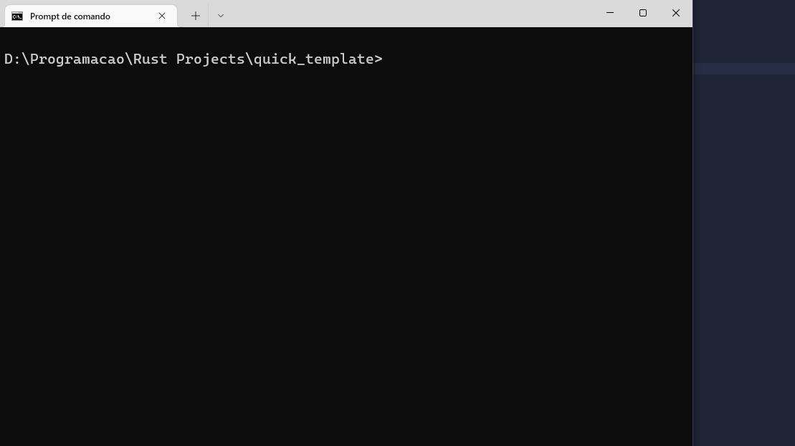

<h1 align="center">
  <br>
  <a href="http://www.ricardodarocha.com.br"></a>
  <br>
  Quick_Template
  <br>
</h1>

<h4>Uma forma simples de gerar templates no formato {{mustaches}} a partir de um arquivo json baseado em <a href="https://docs.rs/handlebars/latest/handlebars/" target="_blank">Handlebars</a>.</h4>

<p align="center">
  <a href="https://badge.fury.io/js/electron-markdownify">
    
  </a>
  <a href="https://gitter.im/amitmerchant1990/electron-markdownify"></a>
  <a href="https://saythanks.io/to/bullredeyes@gmail.com">
      
  </a>
  <a href="https://www.paypal.me/AmitMerchant">
    
  </a>
</p>

<p align="center">
  <a href="#introdução">Introdução</a> •
  <a href="#como-usar">Como usar</a> •
  <a href="#download">Download</a> •
  <a href="#credits">Credits</a> •
  <a href="#related">Related</a> •
  <a href="#license">License</a>
</p>



## Introdução

Se você pretende preencher um template de documento, você pode marcar os campos com um par de mustaches {{}}, no meio dessas chaves você coloca o nome do campo

**Exemplo**
```
Olá {{usuario}},
bem vindo ao sistema {{}}.
Hoje é {{dd}} de {{mmmm}}.
O tempo está {{tempo}}.
```

Os campos podem ser substituídos por um conteúdo em JSON
**dados.json**
```json
{"usuario": "Convidado",
"sistema": "Rust",
"dd": 26,
"tempo": "ensolarado"
}```

##a Como usar

Clone este repositório [Git](https://github.com/ricardodarocha/quick_template.git) 
Rode o comando `cargo run -- arquivos/template.txt arquivos/dados.json gerado/documento.txt`
Você verá que o documento.txt será criado na pasta "gerado"

```bash
# Clone this repository
$ git clone https://github.com/ricardodarocha/quick_template.git

# Go into the repository
$ cd quick_template

# Abra com VSCode
$ code .

# Rode o aplicativo passando os parâmetros
$ cargo run -- arquivos/template.txt arquivos/dados.json gerado/documento.txt
```

## Download

Você pode baixar a última versão estável do binário em ...

## Emailware

Caso necessite de suporte ou queira personalizar este projeto você pode entrar em contato comigo <ricardodarocha@outlook.com> 

## Credits

This software uses the following open source packages:

- [Handlebars](https://docs.rs/handlebars/latest/handlebars)
- [Serde_Json](https://docs.rs/serde_json/latest/serde_json/)

## Related

[Rust](https://www.rust-lang.org/pt-BR) - A linguagem mais querida 🦀

## Contato

> Linkedin [ricardo-da-rocha-vitor](https://www.linkedin.com/in/ricardo-da-rocha-vitor-a0983932/)
> Site [ricardodarocha.com.br](https://www.ricardodarocha.com.br) &nbsp;&middot;&nbsp;
> GitHub [@ricardodarocha](https://github.com/ricardodarocha) &nbsp;&middot;&nbsp;
> Twitter [@ricardorochadev](https://twitter.com/ricardorochadev)


## You may also like...

- [Tera](https://crates.io/crates/tera) 
- [Tera-cli](https://crates.io/crates/tera-cli)
- [Askama](https://crates.io/crates/askama)
- [Minijinja](https://crates.io/crates/minijinja)

## License


---
